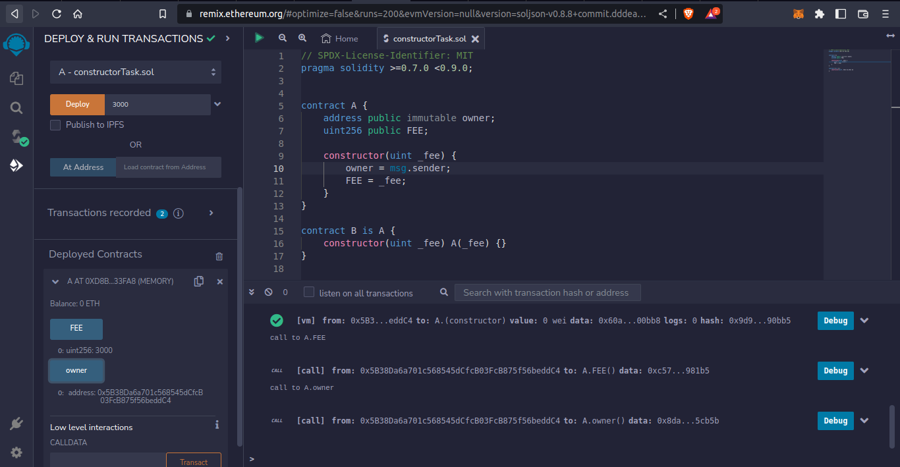
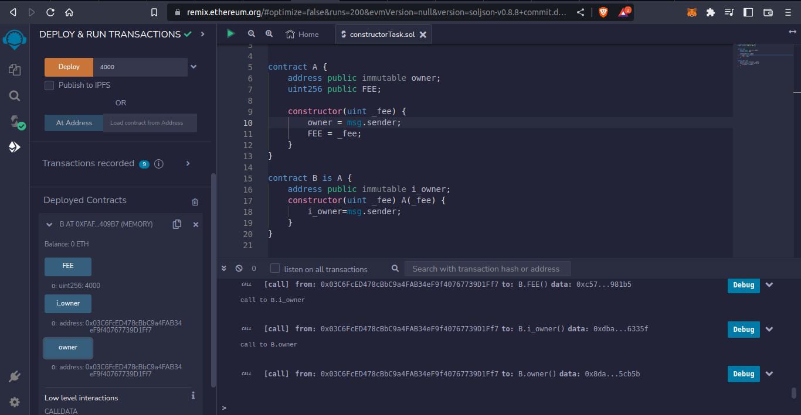

# Task - Constructor Functions

- Growic Solidity Developer Program

Smart contract that uses the constructor function to set and initialize the owner and the FEE state variables defined.

## Sample Output I

Calling contract A

## Sample Output II

Calling contract B

